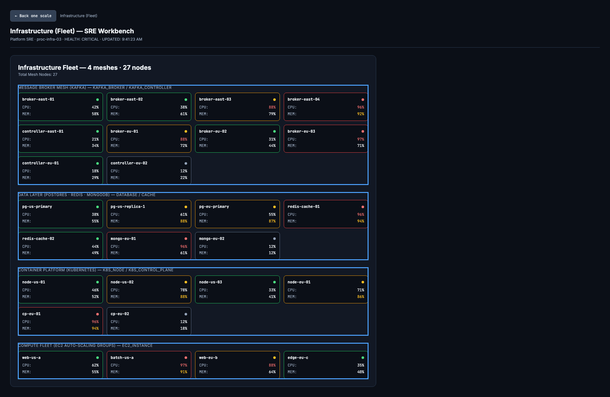
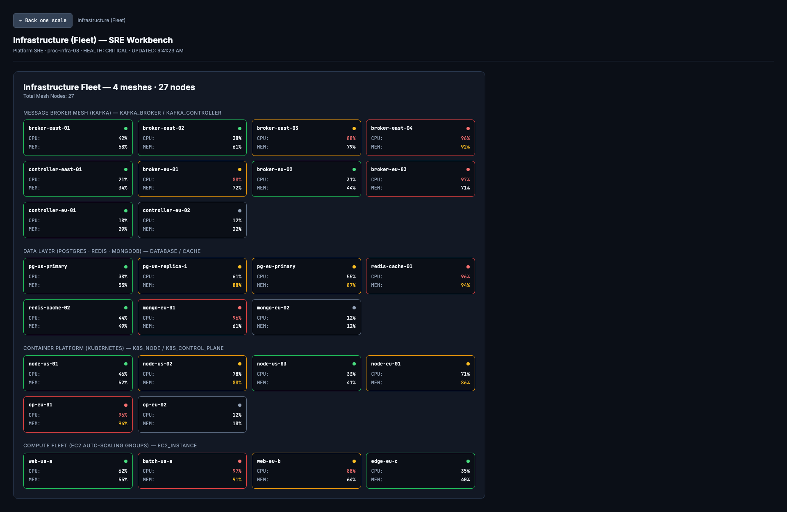

# Viewing-Model Field Guide — how to read a workbench page

Companion to `ui-vantage-blueprint.md` (architecture) — this guide answers a
narrower question: **"I'm staring at a deep-canvas page; what are all these
boxes, and how do I know which ones can be clicked?"** Everything here is
true of the Infrastructure (Fleet) workbench, which is the densest case;
§5 generalizes.

Annotated screenshot (blue outline = grid sections: each group's keyed title
+ its mirrored member cells. There is **no chip strip** on this page, and
that is deliberate — §3/§4):

Plain render:

---

## 1. The page, region by region

| Region | What it is | Where the data comes from |
|---|---|---|
| **Context path** (top bar) | An ordered trail of viewing frames: `← Back one scale` pops the last frame; clicking a crumb truncates the trail to that point. | Shell state — a *path*, not a tier stack |
| **Workbench header** | The entity being viewed: label · kind hint · upstream `HEALTH:` · `UPDATED:` clock. Display only. | `focusFrame()` lookup |
| **Canvas** (`data-testid="archetype-canvas"`) | Exactly one canvas, painting the *deep payload* of whichever entity the last frame names. | registry lookup: sub-entity `deepView` → process `DeepComponent` → visible fallback banner (never a blank) |
| **Sub-entity chains strip** (`data-testid="child-drills"`) | Chips — compact `OverviewTile`s (desk density) for drillable children of the frame's target **that have no canvas instance on this page**. Absent when the canvas mirrors all of them. | `childrenOf(frame) − mirroredIds` |

On the Infrastructure workbench the canvas shows **four grids** (Kafka / Data
/ Kubernetes / Compute meshes, 27 member cells total). Each grid's **title
names its group** (one scale above the nodes) and is keyed to the group
entity, so the title itself is that group's one live instance — click it and
the group's drawer opens. There is **no chip strip** on this page: the canvas
already mirrors everything the strip would list, so the one-instance rule
empties it.

## 2. Words you need

Canonical cross-layer naming lives in `terminology.md` (authoritative);
this section is the per-page cheat sheet. The three axes it assumes —
MODE (how you look) × TARGET (what scale) × LAYER (data/renderer/surface) —
are explained there; here, "entity" always means the data, "mirror entry"
its display copy, "cell" the DOM box.

- **Viewing MODE** — one of `overview` · `detail` · `deep` (each with its
  usual surface: wall tiles/chips · drawers · workbench pages). Modes are
  ways of looking, not data tiers; the same view primitives serve every
  scale.
- **Entity (`EnrichedEntity`)** — *data*, not UI: one entry in the
  envelope's `entities` record, with `parentId`, `depth`, `healthState`,
  `detail` and optionally a private `deep` payload.
- **Entity chain** — an entity and the entities under it (children keyed by
  `parentId`). Chains terminate when the data runs out; separately, a
  *drill path* can be refused at the frame cap (see "cap" below) —
  termination is about data, refusal is about navigation.
- **Mirror entry** — an entry in a topology/FLOW payload (`nodes[]` /
  `grids[].nodes`): a keyed *display copy* of whatever entity its
  `entityId` points at — or a pure display entry with no entity behind it.
- **Cell** — the DOM box a mirror entry paints. A *linked* cell (its entry
  carries an `entityId`) renders as a **button** and is that entity's live
  instance on this page; an *inert* cell is decoration.
- **Mirror link (`entityId`)** — the seed-time key that says "this cell IS
  that entity." Drift re-stamps mirror cells from the drifted entity each
  tick (`mirrorChainHealth`), so a canvas copy can never disagree with the
  drawer opened from it.
- **Grid** — the section partition of the fleet TOPOLOGY payload
  (`payload.grids`): one section per infrastructure group, each keyed to
  its group entity (`groupId`) so the section TITLE renders as that
  group's ONE live instance. Titles and member lists are upstream-computed
  display data, never derived in the canvas component (Principle 1).
- **Group (`INFRA_GROUP`)** — a depth-2 *container* entity (one of the four
  meshes): a Kafka cluster, a data tier, a k8s mesh, an EC2 fleet — one
  scale ABOVE the member entities it contains. Has a drawer (narrative +
  one reading per member, recomputed upstream). Its chain **terminates in
  the drawer**: groups carry no private canvas (their mesh already exists,
  one scale above, on the fleet canvas). Groups are never triage rows —
  the list lists members.
- **Member (`INFRA_MEMBER`)** — a depth-3 *leaf* entity (broker, DB, k8s
  node, ASG). Its drawer is where its chain terminates (members carry no
  private canvas).
- **Chip** — a desk-density `OverviewTile`. A chip exists ONLY for a
  drillable child that no canvas instance mirrors on this page; empty
  where the canvas mirrors them all (the Infrastructure page).
- **"depth 2 ≤ cap 3" (chip-strip header)** — describes the *targets*
  listed below it, not the chips themselves. The cap counts
  **context-path frames** (pushes spend budget; mode swaps don't), not
  entity kinds; `drillInto` refuses a refused-budget push and logs it.

## 3. The one-live-instance rule (why nothing appears twice)

Every drillable entity has **exactly one clickable instance per page — never
zero, never two**:

- If a canvas payload **mirrors** the entity (a cell or keyed grid title
  carries its id), **that instance is the affordance** (button; `data-entity`
  rides the precomputed key, `data-status` the upstream health). The chip
  strip yields.
- If **no canvas mirrors it**, it appears as a **chip** — so no entity ever
  loses its only drill path.

Read any page in three glances:

1. Clickable canvas instances — member cells and keyed grid titles → live
   instances of mirrored children (the keyed title IS the group; the cells
   under it ARE its nodes).
2. Inert cells → copies with no entity behind them (or their entity's only
   live instance is the drawer you'd open by another route — e.g. the
   watchlist rows in a drawer, which are page-permanent, not canvas-scoped).
3. Chips → children with *no* canvas instance at all.

## 4. So what does the chip strip say that the grids don't?

On the Infrastructure page: nothing — and that is exactly why it isn't
there. Two scales share one canvas, each named **once**: a **group** (a Kafka
cluster, a data tier, a k8s mesh, an EC2 fleet) sits one scale ABOVE its
**nodes** (brokers, controllers, DBs, workers, ASGs); keyed titles carry the
groups, cells under each title carry the nodes.

An earlier draft listed the four groups twice — as grid titles *and* as a
chip strip — and the duplication was a bug, not a feature. The chips' only
extra content was a drill entry, and the same targets were already one
click away through the grids (member cells drill straight to the node's
drawer; keyed grid titles drill to the group's drawer) while the strip's
drill path could degrade: on the canvas page the trail was already 2
frames deep, and a chain that turns over in the group drawer
(`[infra:detail, infra:deep, group:detail]` = the 3rd frame) leaves no
push-budget for member nodes below it — the frame guard refuses the next
`drillInto` and logs the refusal. The supported way down is always the
**jump**: any triage/watchlist row jumps straight to that node's drawer
(`[source:detail, node:entity]` = 2 frames), bypassing the mid-path hop.

## 5. The same rule on other pages

- **Payment clearing canvas** — the FLOW nodes `n1–n3` mirror the flow-node
  entities, so on the process canvas page they have cell-instances, not
  chips; drilling `n1` opens its drawer, whose own mini-FLOW mirrors
  `c1–c3`. Mode swaps are free (§6-2), so chains routed through canvas
  pages fit the cap: `[P:detail] → [P:deep]` (1 frame) → `n1` drawer (2)
  → `n1` mini-canvas (2) → `c1` drawer (3). A route with more pushes than
  the cap allows is refused by the guard, which logs
  `Depth cap (3) reached — deeper drill refused.` when it fires.
- **PCI gate / Liquidity Gate canvases** — RULE_GATE payloads key on
  `rules[]`, not `nodes[]`/`grids`, so nothing is mirrored: the rule
  entities appear as **chips** (their only affordance).
- **FX quote mesh / EC2 heatmaps** — HEATMAP payloads key on `serviceRows`,
  likewise unmirrored → their row entities are chip-drillable.

## 6. Design notes (what is decided, and why)

1. **Keyed grid titles.** The infra canvas has no chip strip because the
   groups are already mirrored there — each group's one live instance is its
   grid title (keyed by `groupId`, rendered as a drill button whose drill
   goes to the group's drawer). An earlier draft showed the groups twice;
   the keying resolved that.
2. **Frames vs chains.** The context-path cap counts **frames** (max 3),
   not entity depth. `drillInto` PUSHES a frame (spends budget); `goDeeper`
   re-MODES the last frame in place (spends nothing — drawer → canvas on the
   same target is free). A drill that would be the 4th push is refused and
   logged (`Depth cap (3) reached — deeper drill refused.`) — refusals are
   visible in the console by design, never silent.
3. **Groups carry no private canvas.** Their meshes already exist one scale
   above, on the fleet canvas (keyed grids + mirrored member cells); a
   second per-group copy would be both a duplicate and a depth-cap dead end.
   If group-scale drill-down is ever needed *as data*, give the group entity
   a `deep` payload — the Shell will mount it without code changes.

## 7. Source pointers

- `packages/ui-sdk/src/App.tsx` — `childrenOf`, `mirroredIds`, `childDrills`
  (the strip), `drillInto` (cap guards), context-path trail.
- `packages/ui-sdk/src/components/archetypes/TopologyArchetype.tsx` — grids +
  linked/inert cell rendering.
- `packages/ui-sdk/src/components/primitives/DetailDrawer.tsx` — triage
  watchlist sections (grouped + flat fallback).
- `packages/ui-sdk/src/mocks/processStateMocks.ts` — upstream engine:
  `buildInfraWatch`/`buildInfraGroups`/`stampFleetWatch` (watchlist
  membership, group rollups), `mirrorChainHealth` (mirror re-stamping, edge
  rebuild), `deriveHealthState` (rollups).
